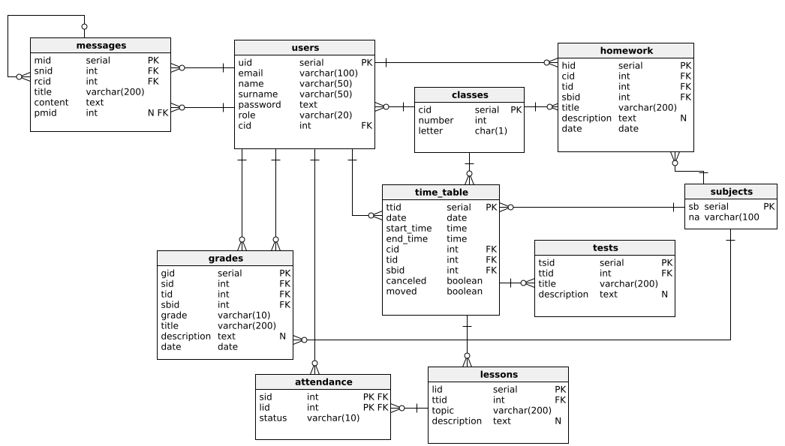

# Spis treści

1. [System e-dziennik](#system-e-dziennik)
2. [Tabele](#tabele)
3. [Widoki](#widoki)

# System e-dziennik

Celem projektu jest stworzenie systemu bazy danych dla aplikacji e-dziennik. Baza danych zajmuje się przechowywaniem danych o użytkownikach, klasach, przedmiotach szkolnych, planie zajęć, lekcjach, obecnościach uczniów na lekcjach, ocenach uczniów, sprawdzianach, zadaniach domowych oraz wiadomościach wysyłanych przy użyciu aplikacji. Spójność danych jest gwarantowana poprzez odpowiednie ograniczenia kolumn w tabelach, triggery sprawdzające spójność przy dodawaniu i aktualizowaniu danych, a także odpowiednim relacją między tabelami. 


[Dokumentacja użytkowa.](./usage.md)

### Diagram ERD



## Tabele

1. Użytkownicy(users)
    Tabela *users* przechowuje użytkowników. Każdy rekord tabeli zawiera dane personalne użytkownika oraz używane aby uwierzytelnić użytkownika, jak również rolę użytkownika (uczeń, nauczyciel, administrator) i przypisanie do klasy, jeżeli użytkownik posiada rolę **student**. Aby zapewnić spójność przypisania uczniów do klas użyto mechanizmu aktualizacji kolumny `cid` przy zmianie `cid` w tabeli *classes* oraz ustawieniu wartości `cid` na **NULL**, gdy klasa do której przypisany został użytkownik zostanie usunięta.

| Nazwa kolumny | Typ | Długość | Opis |
|-|-|-|-|
| uid | SERIAL | - | Unikatowy identyfikator przypisany do użytkownika |
| email | VARCHAR | 100 | Adres e-mail użytkownika. |
| name | VARCHAR | 50 | Imie użytkownika. |
| surname | VARCHAR | 50 | Nazwisko użytkownika. |
| password | TEXT | - | Hasło do konta użytkownika. |
| role | VARCHAR | 20 | Rola użytkownika (np. admin, student). |
| cid | INTEGER | - | Identyfikator klasy (tylko dla użytkowników o roli student). |

Dodatkowe informacje :
* Klucz główny : `uid`
* Klucze obce :
    * `cid`
* Obowiązkowe kolumny :
    * `email`
    * `name`
    * `surname`
    * `password`
    * `role`
* Ograniczenia :
    * `email` - unikalna wartość
    * `role` - wartość z listy roli : 
        * admin - administrator systemu
        * teacher - nauczyciel
        * student - uczeń
    * `cid` - tylko użytkownicy z rolą student
* Wartości domyślne :
    * `cid` - domyślnie **NULL**

2. Klasy(classes)
    Tabela *classes* przechowuje listę klas.

| Nazwa kolumny | Typ | Długość | Opis |
|-|-|-|-|
| cid | SERIAL | - | Unikatowy identyfikator klasy. |
| number | INTEGER | - | Numer klasy (np. 1, 2, 7). |
| letter | CHAR | 1 | Litera klasy (np. A, B, D). |

Dodatkowe informacje :
* Klucz główny : `cid`
* Obowiązkowe kolumny : 
    * `number`
    * `letter`.
* Ograniczenia : 
    * `number` - cyfra z przedziału 0-8
    * `letter` - wielka litera (np. A, B, D, G)
    * (`number`, `letter`) - wartość unikalna

3. Przedmioty(subjects)
   Tabela *subjects* przechowuje listę przedmiotów.

| Nazwa kolumny | Typ | Długość | Opis |
|-|-|-|-|
| sbid | SERIAL | - | Identyfikator przedmiotu. |
| name | VARCHAR | 100 | Nazwa przedmiotu. |

Dodatkowe informacje :
* Klucz główny : `sbid`
* Obowiązkowe kolumny : 
    * `name`.
* Ograniczenia :
    * `name` - unikalna wartość

4. Plan zajęć(time_table)
    Tabela *time_table* przechowuje zajęcia z planu zajęć. Do każdych zajęć jest przypisany identyfikator, dzień, w którym te zajęcia się odbywają, godzina rozpoczęcia i zakończenia zajęć. Nauczyciel prowadzący zajęcia jest zdefiniowany poprzez identyfikator `tid`, natomiast klasa, której dotyczą zajęcia, jest przypisana dzięki kolumnie `cid`, a przedmiot szkolny przypisano poprzez `sbid`. Każde zajęcia posiadają dwie flagi `canceled` oraz `moved`, które definiują czy zajęcia są odwołane, albo zostały przesunięte względem oryginalnego planu. Kolumna `cid` jest automatycznie aktualizowana po zmianie `cid` w tabeli *classes*, `sbid` aktualizuje się po zmianie `sbid` w tabeli *subjects*, a `tid` po zmianie `uid` w tabeli *users*. Jeżeli klasa, która jest przypisana do zajęć, zostanie usunięta zajęcia również zostana usunięte z planu zajęć, dla przedmiotu szkolnego mechanizm zachowywania spójności przy usuwaniu przedmiotu działa tak samo, natomiast w przypadku usunięcia nauczyciela, który prowadzi zajęcia, kolumna `tid` zostaje ustawiona na **NULL** co pozwala na przypisanie innego nauczyciela do zajęć bez konieczności dodawania ich od nowa.

| Nazwa kolumny | Typ | Długość | Opis |
|-|-|-|-|
| ttid | SERIAL | - | Identyfikator zajęć w planie zajęć. |
| date | DATE | - | Dzień, w którym mają odbywać się zajęcia. |
| start_time | TIME | - | Godzina rozpoczęcia zajęć. |
| end_time | TIME | - | Godzina zakończenia zajęć. |
| cid | INTEGER | - | Identyfikator klasy, której dotyczą zajęcia. |
| tid | INTEGER | - | Identyfikator nauczyciela, który prowadzi zajęcia. |
| sbid | INTEGER | - | Identyfikator przedmiotu. |
| canceled | BOOLEAN | - | Flaga informująca czy zajęcia zostały odwołane. |
| moved | BOOLEAN | - | Flaga informująca czy zajęcia zostały przesunięte (np. odbywają się w innym dniu lub o innej godzinie). | 

Dodatkowe informacje : 
* Klucz główny : `ttid`
* Klucze obce : 
    * `cid`
    * `tid`
    * `sbid`
* Obowiązkowe kolumny : 
    * `date`
    * `start_time`
    * `end_time`
    * `cid`
    * `tid`
    * `sbid`
* Domyślne wartości : 
   * `canceled` - domyślnie **false**
   * `moved` - domyślnie **false**
* Dodatkowe warunki :
    * (`date`, `start_time`, `end_time`) - klasa nie może mieć w tym czasie innych zajęć
    * `tid` - użytkownik o tym identyfikatorze musi mieć rolę **teacher**
* Triggery :
    * *time_table_insert_trigger* - trigger wywoływany podczas wstawiania rekordu do tabeli, sprawdza czy klasa o podanym numerze id ma zaplanowane zajęcia w podanym czasie, oraz czy użytkownik o podanym identyfikatorze ma rolę **teacher**
    * *time_table_update_trigger* - trigger wywoływany podczas aktualizacji rekordu z tabeli, sprawdza czy klasa o podanym numerze id ma zaplanowane zajęcia w podanym czasie, oraz czy użytkownik o podanym identyfikatorze ma rolę **teacher**

5. Lekcje(lessons)
    Tabela *lessons* zawiera lekcje, które zostały przeprowadzone przez nauczycieli. Przy dodawaniu nowej lekcji wymagane jest podanie tematu zajęć, ale dodanie opisu lekcji nie jest obowiązkowe. Każda lekcja jest przypisana do odpowiednich zajęć poprzez `ttid`. Jeżeli `ttid` w tabeli *time_table* zostanie zaktualizowany identyfikator zajęć w tabeli *lessons* również zostanie zaktualizowany aby zachować spójność danych. Jeżeli zajęcia, do których przypisana jest lekcja, zostaną usunięte, lekcja również zostanie usunięta.

| Nazwa kolumny | Typ | Długość | Opis |
|-|-|-|-|
| lid | SERIAL | - | Identyfikator lekcji. |
| ttid | INTEGER | - | Identyfikator zajęć w planie zajęć. |
| topic | VARCHAR | 200 | Temat lekcji. |
| description | TEXT | - | Opis lekcji. |

Dodatkowe informacje : 
* Klucz główny : `lid`
* Klucze obce : 
    * `ttid` - Identyfikator zajęć w planie zajęć.
* Obowiązkowe kolumny : 
    * `ttid`
    * `topic`
* Wartości domyślne :
    * `description` - domyślnie **NULL**
* Ograniczenia :
    * `ttid` - wartość unikalna
* Dodatkowe warunki :
    * `ttid` - lekcja nie może być przypisana do odwołanych zajęć, wartość nie może być zmieniana
* Triggery :
    * *lessons_insert_table* - trigger wywoływany przy dodawaniu rekordu do tabeli, sprawdza czy zajęcia z planu zajęć ne są odwołane
    * *lesson_insert_attendance* - trigger wywoływany przy dodawaniu rekordu do tabeli, dodaje rekordy do tabeli attendance ze statusem **undefined** dla wszystkich uczniów których dotyczy lekcja

6. Obecność(attendance)
    Tabela *attendance* zawiera listę obecności uczniów na lekcji. Obecność dla uczniów jest dodawana automatycznie po utworzeniu lekcji dla wszystkich uczniów z klasy, status ustawiany jest jako niezdefiniowany (**undefined**). Aby zachować spójność danych kolumna `lid` zostaje automatycznie zaktualizowana, po aktualizacji kolumny `lid` w tabeli *lessons*. Po usunięciu lekcji z tabeli *lessons* wszystkie rekordy z `lid` usuniętej lekcji również zostają usunięte. Zmiana `uid` ucznia, którego obecność jest zapisana w tabeli jest aktualizowana automatycznie, natomiast usunięcie ucznia z tabeli *users* powoduje usunięcie wszystkich rekordów z `sid` równym `uid` usuniętego ucznia.

| Nazwa kolumny | Typ | Długość | Opis |
|-|-|-|-|
| sid | INTEGER | - | Identyfikator ucznia |
| lid | INTEGER | - | Identyfikator lekcji. |
| status | VARCHAR | 10 | Status obecności (np. present, absent) |

Dodatkowe informacje : 
* Klucze obce :
    * `sid`
    * `lid`
* Obowiązkowe kolumny : 
    * `sid`
    * `lid`
    * `status`
* Ograniczenia : 
    * `status` - wartość z listy statusów obecności : 
        * undefined
        * present
        * absent
        * late


7. Oceny(grades)
    Tabela *grades* zawiera listę ocen uczniów. Rekord tabeli zawiera identyfikator ucznia, który otrzymał ocenę, identyfikator nauczyciela wystawiającego ocenę, identyfikator przedmiotu, którego dotyczy ocena, ocenę zapisaną jako ciąg znaków, tytuł i opis oceny, oraz datę wystawienia oceny. Kolumny `sid`, `tid`, `sbid` są aktualizowane automatycznie, gdy wystąpią zmiany w identyfikatorach zapisanych w innych tabelach. W przypadku usunięcia ucznia, do którego przypisana jest ocena, lub usunięcia przedmiotu, z którego ocena została wystawiona, rekord zostaje usunięty. Jeżeli usunięty został nauczyciel, który wystawił ocenę, `tid` zostaje ustawione na wartość **NULL**.

| Nazwa kolumny | Typ | Długość | Opis |
|-|-|-|-|
| gid | SERIAL | - | Identyfikator oceny |
| sid | INTEGER | - | Identyfikator ucznia |
| tid | INTEGER | - | Identyfikator nauczyciela, który dodał ocenę. |
| sbid | INTEGER | - | Identyfikator przedmiotu, którego dotyczy ocena. |
| grade | VARCHAR | 10 | Ocena (np. bdb, dop, nb, np). |
| title | VARCHAR | 200 | Tytuł oceny. |
| description | TEXT | - | Opis oceny. |
| date | DATE | - | Data wystawienia oceny. |

Dodatkowe informacje : 
* Klucz główny : `gid`
* Klucze obce : 
    * `sid`
    * `tid`
    * `sbid`
* Obowiązkowe kolumny :
    * `sid`
    * `tid`
    * `sbid`
    * `grade`
    * `title`
* Wartości domyślne : 
    * `description` - domyślnie **NULL**
    * `date` - domyślnie **NOW()**
* Ograniczenia : 
    * `grade` - wartość z listy ocen : 
        * ndst (1)
        * dop (2)
        * dst (3)
       * db (4)
        * bdb (5)
        * cel (6)
        * np (nie przygotowany)
        * nb (brak oceny np. nieobecny na sprawdzianie)
        * o (inne)
* Dodatkowe warunki :
    * `sid` - użytkownik o tym identyfikatorze musi mieć rolę **student**
    * `tid` - użytkownik o tym identyfikatorze musi mieć rolę **teacher**
* Triggery : 
    * *grades_table_insert_trigger* - - trigger wywoływany podczas wstawiania rekordu do tabeli, sprawdza czy uczeń o podanym id faktycznie posiada rolę **student**, oraz czy nauczyciel o podanym id faktycznie posiada rolę **teacher**
    * *grades_table_update_trigger* - - trigger wywoływany podczas aktualizacji rekordu z tabeli, sprawdza czy uczeń o podanym id faktycznie posiada rolę **student**, oraz czy nauczyciel o podanym id faktycznie posiada rolę **teacher**

8. Sprawdziany(tests)
    Tabela *tests* zawiera listę sprawdzianów. Sprawdzian jest przypisany do zajęć w planie zajęć, oraz musi posiadać tytuł, opis sprawdzianu nie jest wymagany. Przy aktualizacji `ttid` w tabeli *time_table* kolumna `ttid` zostaje zaktualizowana automatycznie, jeżeli zajęcia zostana usunięte sprawdzian również zostaje usunięty.

| Nazwa kolumny | Typ | Długość | Opis |
|-|-|-|-|
| tsid | SERIAL | - | Identyfikator sprawdzianu |
| ttid | INTEGER | - | Identyfikator zajęć z planu zajęć. |
| title | VARCHAR | 200 | Tytuł sprawdzianu. |
| description | TEXT | - | Opis sprawdzianu. |

Dodatkowe informacje :
* Klucz główny : `tsid`
* Klucze obce : 
    * `ttid`
* Obowiązkowe kolumny : 
    * `ttid`
    * `title`
* Domyślne wartości :
    * `description` - domyślnie **NULL**

9. Zadanie domowe(homework)
    Tabela *homework* zawiera listę zadań domowych. Zadanie domowe jest przypisane przez nauczyciela do wybranego przedmiotu oraz klasy poprzez odpowiednie indentyfikatory. Każde zadanie domowe musi zawierać tytuł i datę zwrotu zadania, opis nie jest wymagany. Przy zmianie identyfikatoru nauczyciela, klasy lub przedmiotu w odpowiedniej tabeli identyfikatory zostają zaktualizowane automatycznie. Usunięcie nauczyciela, klasy lub przedmiotu powoduje usunięcie wszystkich powiązanych zadań domowych.

| Nazwa kolumny | Typ | Długość | Opis |
|-|-|-|-|
| hid | SERIAL | - | Identyfikator zadania domowego. |
| cid | INTEGER | - | Identyfikator klasy, której dotyczy zadanie domowe. |
| tid | INTEGER | - | Identyfikator nauczyciela, który zadał zadanie domowe. |
| sbid | INTEGER | - | Identyfikator przedmiotu, którego dotyczy zadanie domowe. |
| title | VARCHAR | 200 | Tytuł zadania domowego. |
| description | TEXT | - | Opis zadania domowego. |
| date | DATE | - | Data, określająca termin oddania zadania domowego. |

Dodatkowe informacje :
* Klucz główny `hid`
* Klucze obce :
    * `cid`
    * `tid`
    * `sbid`
* Obowiązkowe kolumny :
    * `cid`
    * `tid`
    * `sbid`
    * `title`
* Domyślne wartości : 
    * `description` - domyślnie **NULL**
    * `date` - domyślnie **NOW()**

10. Wiadomości(messages)
    Tabela *messages* zawiera wiadomości wysyłane przez użytkowników. Nadawca i odbiorca wiadomości jest identyfikowany na podstawie wartości `snid` i `rcid`. Każda wiadomość musi zawierać tytuł i zawartość. Wiadomość może być odpowiedzią do innej wiadomości poprzez ustawienie pola `pmid`. Aktualizacja wartości `uid` powiązanej z `snid` lub `rcid` powoduje automatyczną aktualizację wartości, usunięcie użytkownika ustawia odpowiedni identyfikator na wartość **NULL**. Zmiana `mid` powiązanego z `pmid` innej wiadomości powoduje zmianę `pmid` w wszystkich powiązanych wiadomościach, natomiast usunięcie powiązanej wiadomości powoduje ustawienie `pmid` na wartość **NULL**.

| Nazwa kolumny | Typ | Długość | Opis |
|-|-|-|-|
| mid | SERIAL | - | Identyfikator wiadomości. |
| snid | INTEGER | - | Identyfikator nadawcy wiadomości. |
| rcid | INTEGER | - | Identyfikator odbiorcy wiadomości. |
| title | VARCHAR | 200 | Tytuł wiadomości. |
| content | TEXT | - | Zawartość wiadomości. |
| pmid | INTEGER | - | Identyfikator poprzedniej wiadomości. |

Dodatkowe informacje :
* Klucz główny : `mid`
* Klucze obce :
    * `snid`
    * `rcid`
    * `pmid`
* Obowiązkowe kolumny :
    * `snid`
    * `rcid`
    * `title`
    * `content`
* Domyślne wartości :
    * `pmid` - domyślnie **NULL**

## Widoki

1. Lista administratorów(admins_list)
    Widok zawierający listę użytkowników o roli administratora. Lista posortowana jest alfabetycznie.

    Kwerenda SQL :
    ```sql
    SELECT uid, email, name, surname
    FROM users
    WHERE role='admin'
    ORDER BY name, surname;
    ```

2. Lista nauczycieli(teachers)
    Widok zawierający listę użytkowników o roli nauczyciela. Lista posortowana jest alfabetycznie.

    Kwerenda SQL :
    ```sql
    SELECT uid, email, name, surname
    FROM users
    WHERE role='teacher'
    ORDER BY name, surname;
    ```
3. Lista uczniów(students_list)
    Widok zawierający listę użytkowników o roli ucznia. Lista posortowana jest według klas oraz alfabetycznie względem imion nazwisk.

    Kwerenda SQL :
    ```sql
    SELECT U.uid, U.email, U.name, U.surname, CONCAT(C.number, C.letter) AS 'class'
    FROM users U
        LEFT JOIN classes C ON U.cid=C.cid
    WHERE role='student'
    ORDER BY C.number, C.letter, U.name, U.surname;
    ```
4. Plan zajęć oraz przeprowadzone lekcje(lessons_list)
    Widok zawierający plan zajęć z przypisanymi lekcjami, które zostały przeprowadzone przez nauczycieli. Plan zajęć jest posortowany według klas.

    Kwerenda SQL :
    ```sql
    SELECT TT.ttid, TT.date, TT.start_time, TT.end_time, SB.name AS subject_name, CONCAT(C.number, C.letter) AS 'class', L.topic, L.description, T.name AS teacher_name, T.surname AS teacher_surname
    FROM time_table TT
        LEFT JOIN lessons L ON TT.ttid=L.ttid
        INNER JOIN classes C ON TT.cid=C.cid
        LEFT JOIN users T ON TT.tid=T.uid
        INNER JOIN subjects SB ON TT.sbid=SB.sbid
    ORDER BY C.number, C.letter, TT.date, TT.start_time;
    ```
5. Lista wiadomości(messages_list)
    Widok zawierający listę wiadomości oraz przypisane poprzednie wiadomości, których dotyczą.

    Kwerenda SQL:
    ```sql
    SELECT M.mid, M.title, M.content, M.snid AS sender_id, SN.name AS sender_name, SN.surname AS sender_surname, M.rcid AS receiver_id, RC.name receiver_name, RC.surname AS receiver_surname, PM.title AS previous_message_title, PM.content AS previous_message_content
    FROM messages M
        INNER JOIN users SN ON M.snid=SN.uid
        INNER JOIN users RC ON M.rcid=RC.uid
        LEFT JOIN messages PM ON M.pmid=PM.mid;
    ```
