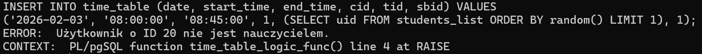
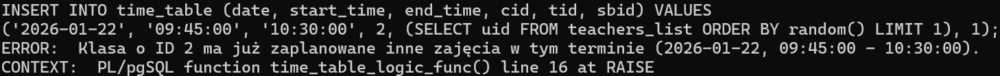
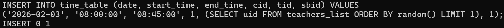
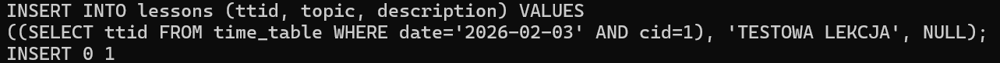
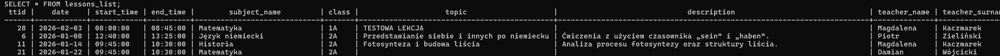
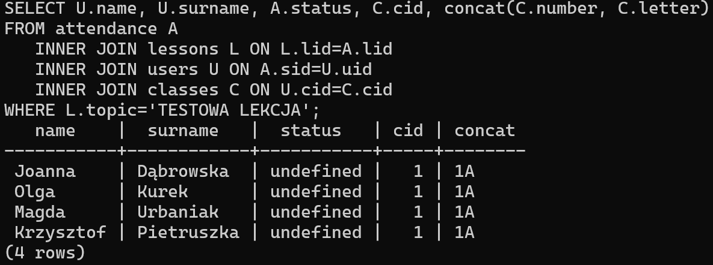
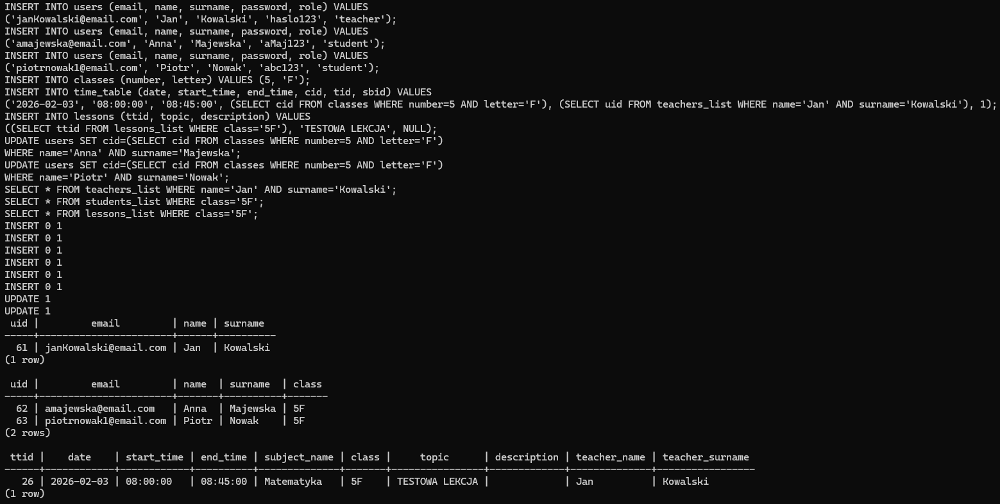
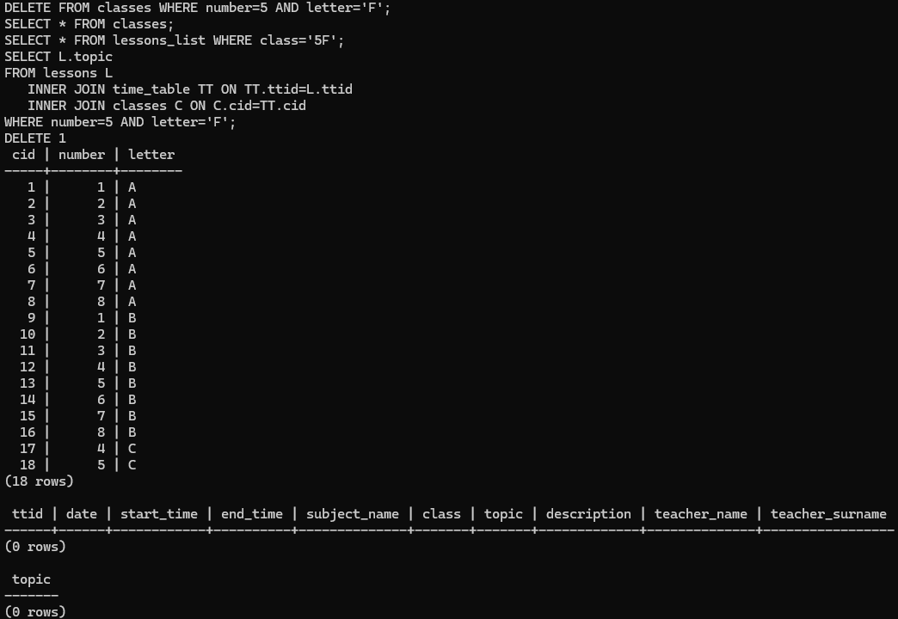
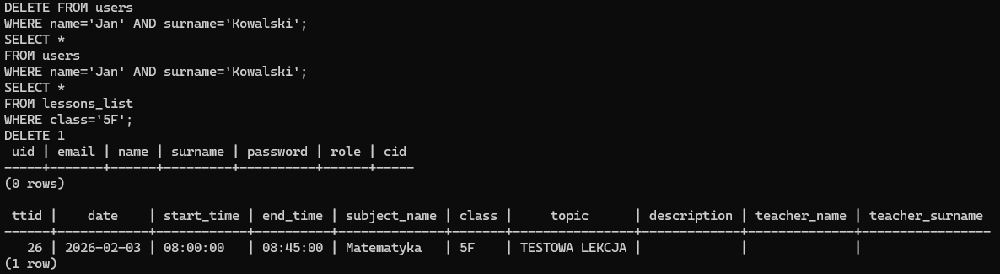
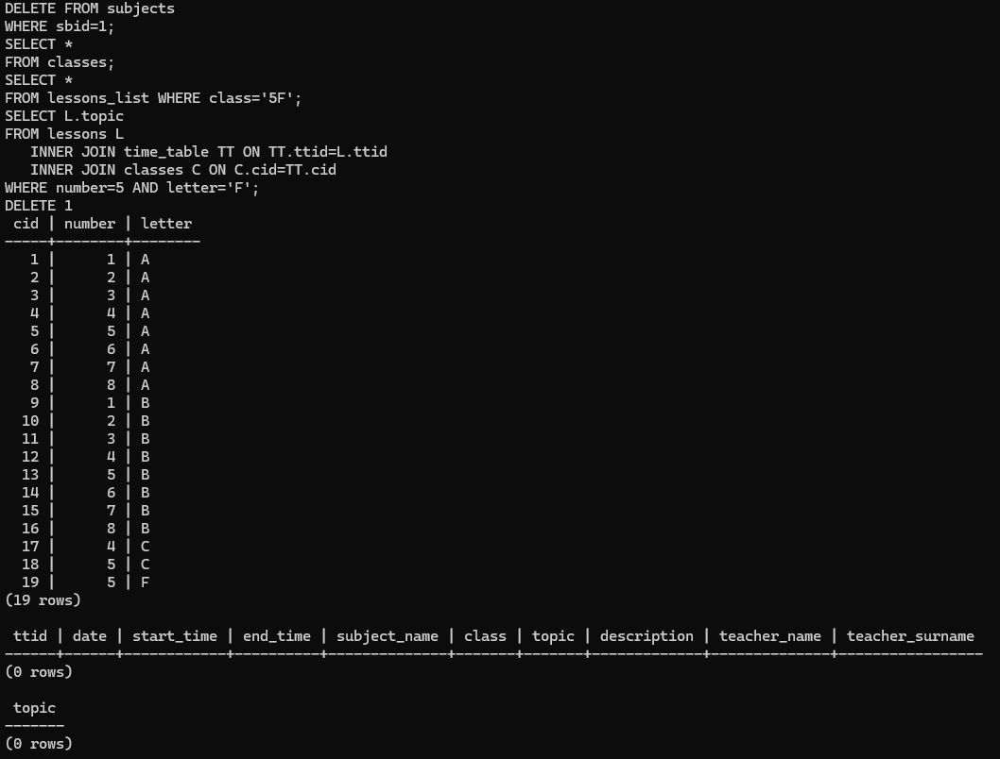

# Testy
Poniżej przedstawiono dwa scenariusze testowe sprawdzające działanie mechanizmów bazy danych. Przed ich wykonaniem należy utworzyć strukturę bazy za pomocą pliku [initialize.sql](./initialize.sql) oraz zaimportować przykładowe dane z pliku [data.sql](./data/data.sql).

## Próba utrzymania spójności danych w bazie podczas dodawania nieprawidłowych danych oraz sprawdzenie automatycznego dodawania obecności

Scenariusz :
1. Próba dodania zajęć do planu zajęć z uczniem jako prowadzącym
```sql
INSERT INTO time_table (date, start_time, end_time, cid, tid, sbid) VALUES
('2026-02-03', '08:00:00', '08:45:00', 1, (SELECT uid FROM students_list ORDER BY random() LIMIT 1), 1);
```
*INSERT* zostaje odrzucony.


2. Próba dodania zajęć do planu zajęć w czasie kiedy klasa ma inne zajęcia

```sql
INSERT INTO time_table (date, start_time, end_time, cid, tid, sbid) VALUES
('2026-01-22', '09:45:00', '10:30:00', 2, (SELECT uid FROM teachers_list ORDER BY random() LIMIT 1), 1);
```
*INSERT* zostaje odrzucony.


3. Poprawe dodanie zajęć do planu zajęć dla klasy o `cid`=1 (klasa 1A)
```sql
INSERT INTO time_table (date, start_time, end_time, cid, tid, sbid) VALUES
('2026-02-03', '08:00:00', '08:45:00', 1, (SELECT uid FROM teachers_list ORDER BY random() LIMIT 1), 1);
```
*INSERT* zostaje przyjęty.


4. Dodanie lekcji
```sql
INSERT INTO lessons (ttid, topic, description) VALUES
((SELECT ttid FROM time_table WHERE date='2026-02-03' AND cid=1), 'TESTOWA LEKCJA', NULL);
```
*INSERT* zostaje przyjęty. Automatycznie zostają dodane wpisy frekwencji dla uczniów klasy 1A.


5. Sprawdzenie czy lekcja została dodana
```sql
SELECT * FROM lessons_list;
```


6. Sprawdzenie czy obecność została poprawnie uzupełniona
```sql
SELECT U.name, U.surname, A.status, C.cid, concat(C.number, C.letter)
FROM attendance A
   INNER JOIN lessons L ON L.lid=A.lid
   INNER JOIN users U ON A.sid=U.uid
   INNER JOIN classes C ON U.cid=C.cid
WHERE L.topic='TESTOWA LEKCJA';
```



## Próba utrzymania spójności danych podczas usuwania danych

Aby poprawnie wykonać test należy przed każdym punktem upewnić się, że w tabelach znajdują się dane dodane za pomocą poniższej kwerendy, w tym celu można przed każdym punktem scenariusza usunąć dane, a następnie utworzyć ją na nowo z plików [initialize.sql](./initialize.sql) i [data.sql](./data/data.sql) oraz wykonać poniższą kwerendę.

Utworzenie danych
```sql
INSERT INTO users (email, name, surname, password, role) VALUES
('janKowalski@email.com', 'Jan', 'Kowalski', 'haslo123', 'teacher');
INSERT INTO users (email, name, surname, password, role) VALUES
('amajewska@email.com', 'Anna', 'Majewska', 'aMaj123', 'student');
INSERT INTO users (email, name, surname, password, role) VALUES
('piotrnowak1@email.com', 'Piotr', 'Nowak', 'abc123', 'student');
INSERT INTO classes (number, letter) VALUES (5, 'F');
INSERT INTO time_table (date, start_time, end_time, cid, tid, sbid) VALUES
('2026-02-03', '08:00:00', '08:45:00', (SELECT cid FROM classes WHERE number=5 AND letter='F'), (SELECT uid FROM teachers_list WHERE name='Jan' AND surname='Kowalski'), 1);
INSERT INTO lessons (ttid, topic, description) VALUES
((SELECT ttid FROM lessons_list WHERE class='5F'), 'TESTOWA LEKCJA', NULL);
UPDATE users SET cid=(SELECT cid FROM classes WHERE number=5 AND letter='F')
WHERE name='Anna' AND surname='Majewska';
UPDATE users SET cid=(SELECT cid FROM classes WHERE number=5 AND letter='F')
WHERE name='Piotr' AND surname='Nowak';
SELECT * FROM teachers_list WHERE name='Jan' AND surname='Kowalski';
SELECT * FROM students_list WHERE class='5F';
SELECT * FROM lessons_list WHERE class='5F';
```


1. Usunięcie klasy
```sql
DELETE FROM classes WHERE number=5 AND letter='F';
SELECT * FROM classes;
SELECT * FROM lessons_list WHERE class='5F';
SELECT L.topic
FROM lessons L
   INNER JOIN time_table TT ON TT.ttid=L.ttid
   INNER JOIN classes C ON C.cid=TT.cid
WHERE number=5 AND letter='F';
```
Po usunięciu klasy usunięte zostały zajęcia i lekcje klasy.


2. Usunięcie nauczyciela
```sql
DELETE FROM users
WHERE name='Jan' AND surname='Kowalski';
SELECT *
FROM users
WHERE name='Jan' AND surname='Kowalski';
SELECT *
FROM lessons_list
WHERE class='5F';
```
Po usunięciu nauczyciela w tabeli *users* identyfikator nauczyciela prowadzącego zajęcia został zmieniony na **NULL**.


3. Usunięcie przedmiotu
```sql
DELETE FROM subjects
WHERE sbid=1;
SELECT *
FROM classes;
SELECT *
FROM lessons_list WHERE class='5F';
SELECT L.topic
FROM lessons L
   INNER JOIN time_table TT ON TT.ttid=L.ttid
   INNER JOIN classes C ON C.cid=TT.cid
WHERE number=5 AND letter='F';
```

Po usunięciu przedmiotu zajęcia i lekcje zostały usunięte z planu zajęć.
